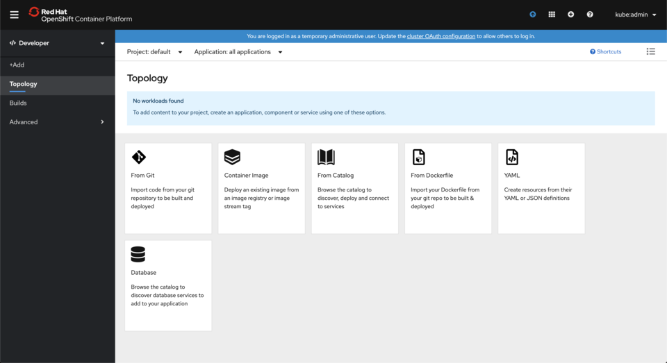
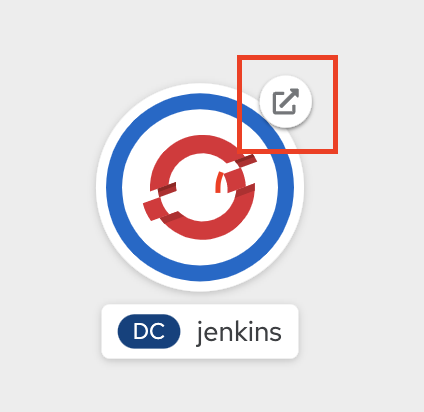

# GitOps Demo

A small GitOps demo you can run on your laptop.

## What's Included

* Argo CD - Both the Operator and an Argo CD server
* CI/CD tools - Only Jenkins for the demo
* Jenkins pipeline and *source-to-image* binary build to create a container image.
* Demo App (Spring Petclinic)
* Quotas, Limits, NetworkPolicies... oh my!

## Prerequisites

* [CodeReady Containers 1.6+](https://developers.redhat.com/products/codeready-containers/overview) - It's free!  Sign up for a free Red Hat account to download and install CodeReady Containers on your local machine.
* [oc command line tool](https://mirror.openshift.com/pub/openshift-v4/clients/ocp/latest/) or `kubectl`

Since you will be running full fledged OpenShift 4 cluster, as well as Argo CD, Jenkins, Maven builds, container image builds, and two application environments, this demo does need a decent amount of resources.  This is the CodeReady Containers configuration that I have tested this demo on locally:

```
$ crc config view
- cpus                                  : 4
- memory                                : 12288
- nameserver                            : 
- pull-secret-file                      : /Users/pitta/Utils/crc/pull-secret.txt
- vm-driver                             : hyperkit
- warn-check-bundle-cached              : true
```

If you need to increase the number of cpu cores or memory your CodeReady Containers instance uses, run the commands:
```
$ crc config set cpus 4
$ crc config set memory 12288
```

Of course, if you have more CPU or Memory, you can bump those numbers up accordingly.  Please note the **cpu** number is *hyper-threded cores*.  For example, a 4-core Intil i7 would have 8 hyper-threaded cores.  In this scenario, giving CodeReady Containers *4 cpus* would allocate it half of the CPU resources of your computer.

## Clone the Demo Repository

Clone this repository and change to the `99-gitops-demo` directory.

```
$ git clone https://github.com/pittar-gitops/99-gitops-demo.git
$ cd 99-gitops-demo
```

## Install Argo CD

### 1. Login with the oc command line tool

Login using the `oc` cli tool as a cluster admin (you can use the `kubeadmin` username and password supplied when you start CodeReady Containers).  

The login command printed when CodeReady Containers starts should look something like:

```
$ oc login -u kubeadmin -p db9Dr-J2csc-8oP78-9sbmf https://api.crc.testing:6443
```

Of coure, your password will be different.

### 2. Install Argo CD

The installation of the Argo CD operator and the creation of an Argo CD server instance are handled by the `setup.sh` script.

Run:
```
$ ./setup.sh
```` 
and wait for the script to complete.  It will take a few minutes to install the operator, then create an Argo CD server instance.

* If you are using Windows, you can simply copy/paste the `oc` commands and run them from DOS, Powershell, or another terminal such as Cygwin or Linux Subsystems for Windows.
* If you want to use `kubectl` instead of `oc`, first create the `argocd` project, then manually run the `oc` commands using `kubectl` instead.

Be sure to note the **Argo CD password** printed when the script completes.  The default Argo CD password is the name of the main Argo CD pod.

### 3. Login to the OpenShift and Argo CD Consoles

Login to the Argo CD console:
* To get the URL for your server, run:
```
$ oc get route argocd-server -n argocd
```  
* Or... just go directly to [https://argocd-server-argocd.apps-crc.testing/](https://argocd-server-argocd.apps-crc.testing/)
* Open the URL in a browser tab.  You will have to accept the self-signed certificate.
* Login with user `admin` and the password printed in the terminal after the opertor finishes installing.

Login to the OpenShift console:

* To open the OpenShift console in a new browser tab, run:  

```
$ crc console
```  

You will have to accept the self-signed certificate.

* Login to OpenShift using the `kubeadmin` username and password printed in the terminal when it started.
* Make sure you are in the **Developer** perspective (change this at the top of the left navigation panel).  The rest of the instructions assume you are in this view.

Your (empty) OpenShift and Argo CD consoles should look like this.  You will fill them up soon!




## Install Demo

### 1. Install Argo CD Projects

[Projects](https://argoproj.github.io/argo-cd/user-guide/projects/) are a way to manage Argo CD [Applications](https://argoproj.github.io/argo-cd/operator-manual/declarative-setup/#applications).

Create the Argo CD *Projects*.  These projects will hold the different Argo CD *Applications*.

```
$ oc apply -f projects
appproject.argoproj.io/demo-apps created
appproject.argoproj.io/demo-cicd created
appproject.argoproj.io/demo-config created
```

This will create Argo CD *projects* for the *demo app*, *configuration*, and *CI/CD tools*.

### 2. Create Argo CD Applications

Argo CD *applications* are custom resources that point to a git repository and the path within that repository where the manifests for your application (or any kind of Kuberntes resources) reside.

#### Create the Cluster Config application.  

```
$ oc apply -f applications/demo-config.yaml 
application.argoproj.io/demo-config created
```

In a real environment, this would be a separate respository that is managed by the team that maintains your cluster.  This is the team that will create namespaces, create quotas and limits, setup network policies, and grant roles to users and service accounts.

To keep things simple, everything is contained in a single git repository for this demo.

* In the Argo CD UI, you will notice a new application appear and begins the *sync* process.
* This will create:
    * Three new projects/namespaces: `cicd`, `demo-dev`, `demo-test`
    * Qutoas and Limits in the `demo-app` and `demo-test` projects.
    * Roles and role bindings to allow Jenkins (in the `cicd` project) to have *admin* access to the `demo-dev` and `demo-test` projects in order to deploy new container images.
    * NetworkPolicy objects only allowing pods to communicate with other pods in the same project.

You can click on the **demo-config** application in the Argo CD UI to see the list of object that were created.

### 3. Create the Demo CI/CD and Builds applications.

```
$ oc apply -f applications/demo-cicd.yaml 
application.argoproj.io/demo-cicd created

$ oc apply -f applications/demo-builds.yaml 
application.argoproj.io/demo-builds created
```

Now we are getting to the interesting stuff.  The **demo-cicd** application points to the *yaml* files requried to create a Jenkins master that is fully integrated with OpenShift.  Later, we will use this Jenkins instance to build our app from source.

The **demo-builds** application sets up two different [BuildConfigs](https://docs.openshift.com/container-platform/4.3/builds/understanding-buildconfigs.html).  It will also create an [ImageStream](https://docs.openshift.com/container-platform/4.3/openshift_images/image-streams-manage.html) to track the container images you will be building.

One of these Build Configs, `petclinic-jenkins-pipeline`, is a [Jenkins Pipeline Build](https://docs.openshift.com/container-platform/4.3/builds/build-strategies.html#builds-strategy-pipeline-build_build-strategies).  It will start a new build on our Jenkins server based on a git repository that has a `Jenkinsfile` in its root.

The other, `petclinic-build`, is a [Source-to-Image](https://docs.openshift.com/container-platform/4.3/builds/build-strategies.html#build-strategy-s2i_build-strategies) (s2i) build.  It will take the binary output that Jenkins produces (an executable *jar* file in this case) and builds a new container image based on this binary (OpenJDK 8 in our case).

A deeper dive into [builds on OpenShift](https://docs.openshift.com/container-platform/4.3/builds/build-strategies.html) is out of scope of this demo.  If you do want to learn more, the [documentation](https://docs.openshift.com/container-platform/4.3/builds/build-strategies.html) is a good place to start.

Now that we have a Jenkins server and a couple of BuildConigs, we are ready to setup our application environments!

In the OpenShift UI, you can switch to the *cicd* project and click on *Topology* (*Project* drop down at the top of the main panel).  Here, you will see a Jenkins server pod (either started or starting).  You will also see the two builds we just created if you click on the *Builds* link from the left nav.  Don't start these yet!

If you want to open the Jenkins UI, you can click on the *open link* icon attached to the pod.  It will ask for your OpenShift login credentials, as this Jenkins image is integrated with OpenShift OAuth.


### 4. Create the DEV and TEST Application Environments

The *policy* part of our DEV and TEST environments has been created for us in a previous step.  We now have empty **demo-dev** and **demo-test** projects (environments) ready to deploy some resources into!  Let's set that up now.  This would be the responsibility of the developement team and these are the resources they would have control over.

Create DEV and TEST applications:

```
$ oc apply -f applications/demo-app-dev.yaml 
application.argoproj.io/demo-app-dev created

$ oc apply -f applications/demo-app-test.yaml 
application.argoproj.io/demo-app-test created
```

If you check your Argo CD console, you will see two new projects have appeared.  Once they have completed their sync, your **demo-dev** and **demo-test** projects in OpenShift will each contain:
* A [DeploymentConfig](https://docs.openshift.com/container-platform/4.3/applications/deployments/deployment-strategies.html) describing how to run your application.
* A Service to load balance traffic to pods on the internal network.
* A [Route](https://docs.openshift.com/container-platform/4.3/networking/routes/route-configuration.html) to expose the application to the outside world.

In each case, Argo CD will use Kustomize to specify the container image that should be used in each environment, as well as a unique URL for the routes in each environment.

If you take a look at either of the projects in the OpenShift UI, you will notice the pods aren't running yet.  That is because Jenkins is responsible for *rolling out* our application once it has been built and tested.  We will do this next!


### 5.  Build and Deploy

So far, we have configured our enviornment (created projects, quotas/limits, and network policies), setup CI/CD tools (well... just Jenkins, but it is not difficult to apply the same pattern to include other tools as well), configured builds, and populated our DEV and TEST environments with the resources required to run the application, but customized for each environment.  The best part is, since this is all in git repositories it is completely reproducible!  With proper source control management policies, it is also traceable and becomes an audit log of cluster and project configuration.  Neat!

Ok, on to the builds.

There are two builds configured, but we will only trigger the Jenkins pipeline build directly.  The other build, an OpenJDK *source-to-image* build, will be triggered by the Jenkins pipeline.

You can trigger this build from the OpenShift UI, or from the `oc` cli.

From the OpenShift UI:

* From the `cicd` project in the OpenShift UI, click on **Builds** item from the left navigation panel.
* Click on the `petclinic-jenkins-pipeline` link.
* From `Action` drop down list at the top-right of the screen, select **Start Build**.
* You can then follow the build progress from the build screen, or click on the **View logs** link to jump straight into the Jenkins build and follow the logs from there.

From teh OpenShift CLI:

Alternatively, you can start the build with the `oc` cli tool:

```
$ oc project cicd
$ oc start-build petclinic-jenkins-pipeline -n cicd
```

This triggeres a Jenkins pipeline build. This will follow the steps in the `Jenkinsfile` located in the root of the associated git repository.  You can view this file here:
[Jenkinsfile](https://github.com/pittar/spring-petclinic/blob/gitops-demo/Jenkinsfile)

The steps in this Jenkins pipeline build are:
* Clone the git repository
* Build and test the application with Maven.  The output is an executable jar named *app.jar*.
* Trigger the *source-to-image* build - uploading the executable jar to be packaged as a container image using the Red Hat OpenJDK base image.
* *Tag* this new image with the `dev` tag.
* Rollout (deploy) the latest `dev` tagged image to the **demo-dev** project.
* *Tag* the `dev` image with the `test` tag.
* Rollout (deploy) the latest `test` tagged image to the **demo-test** project.

You should be able to access your Jenkins instance at [https://jenkins-cicd.apps-crc.testing/](https://jenkins-cicd.apps-crc.testing/).  Login using your kubeadmin username and password.  This Jenkins instance is integrated with OpenShift OAuth.

You can follow along with the build in the OpenShift UI, or you can follow the logs in Jenkins.

You can then see your running dev and test apps!  They will be accessible at:
* DEV: [http://petclinic-dev.apps-crc.testing/](http://petclinic-dev.apps-crc.testing/)
* TEST: [http://petclinic-test.apps-crc.testing/](http://petclinic-test.apps-crc.testing/)

## Conclusion

Although this is a simple demo, it gives you a sense of how GitOps can fit into a well balanced CI/CD diet!
